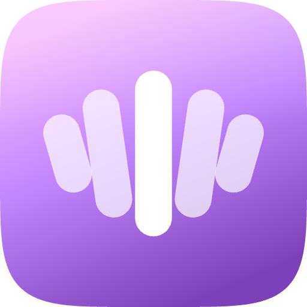
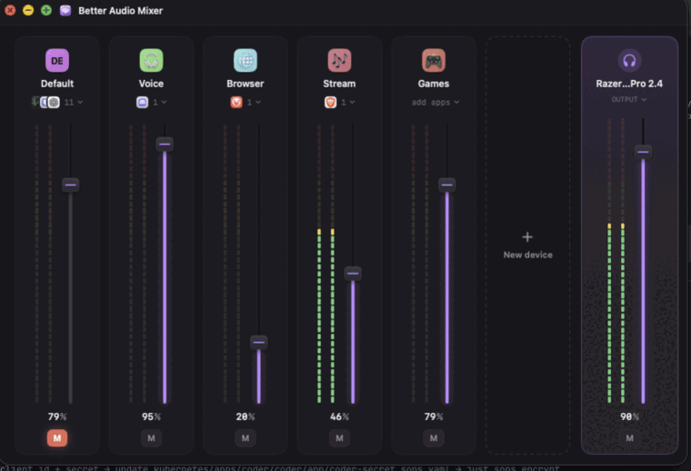

<div align="center">
  
  <h1>bam — Better Audio Mixer</h1>
</div>

<p align="center">
  
</p>

A per-app audio mixer and router for macOS. Route any app to the output you
choose, set per-app levels, and watch live meters — all from one console.

Built on the CoreAudio process-tap API (macOS 14.4+). No kernel extension, no
SIP changes.

## Requirements

- macOS 14.4 or later
- Audio-capture permission (prompted on first launch — needed to meter and route
  other apps' audio)

## Install

### Homebrew

```sh
brew install --cask lkshrk/tap/bam
```

### Manual

Grab `bam.zip` from the [latest release](https://github.com/lkshrk/better-audio-mixer/releases/latest),
unzip, and drag `bam.app` to `/Applications`. Releases are Developer ID signed
and notarized — no Gatekeeper workaround needed.

## Stream Deck plugin

bam ships an optional Elgato Stream Deck plugin so you can mute, adjust, and
switch routing from your deck — keys or dials — without opening the console. It
talks to the running app over a local socket; the app must be running.

Three actions:

- **Device** — mute, adjust, or set the level of one app group. On a key it
  renders a styled tile (colored monogram, name, %, and meter artwork) in one
  of three styles — Level Meter, Level Bars, or Radial Gauge — picked in the
  Property Inspector. On a dial it shows a smooth live LCD meter with the same
  controls.
- **Master** — the same, for the master bus.
- **Output Device** — set or toggle the active hardware output. The key shows
  the same device icon the console uses (headphones, speaker, display…),
  resolved live from the app.

### Install the plugin

The plugin ships in the same release as the app. Grab
`me.harke.better-audio-mixer.streamDeckPlugin` from the
[latest release](https://github.com/lkshrk/better-audio-mixer/releases/latest)
and double-click it to install. It is signed and notarized; first launch needs a
network connection for the online notarization check.

## Diagnostics

bam records compact logs for router recovery, audio-driver status, local
control-socket events, and Stream Deck plugin connections. See
[docs/logging-and-diagnostics.md](docs/logging-and-diagnostics.md) for useful
log categories and support-report notes.

## Build from source

Requires [XcodeGen](https://github.com/yonaskolb/XcodeGen) and Xcode 16+.

```sh
xcodegen generate
xcodebuild -project bam.xcodeproj -scheme bam -configuration Release \
  -derivedDataPath .build build
open ".build/Build/Products/Release/bam.app"
```

Run the tests:

```sh
xcodebuild -project bam.xcodeproj -scheme bam -configuration Debug \
  -derivedDataPath .build test
```

## Project layout

| Path | What |
|------|------|
| `App/` | SwiftUI console UI + `ConsoleViewModel` |
| `BamKit/Sources/BamCore/` | Pure routing model, config, protocols |
| `BamKit/Sources/AudioEngine/` | CoreAudio engine, process taps, mixer |
| `BamKit/Sources/BamControlKit/` | Local control socket server (app ↔ plugin) |
| `BamKit/Sources/BAMStreamDeck/` | Stream Deck plugin executable |
| `StreamDeck/me.harke.better-audio-mixer.sdPlugin/` | Plugin bundle (manifest, PIs, layouts) |
| `BAMDriver/` | Virtual audio driver (C) |
| `project.yml` | XcodeGen project definition |

## License

The bam app and BamKit are MIT licensed (see [LICENSE](LICENSE)).

The virtual audio driver (`BAMDriver/`) is a derivative of
[BlackHole](https://github.com/ExistentialAudio/BlackHole) and is licensed under
GPL-3.0 (see [BAMDriver/LICENSE](BAMDriver/LICENSE) and
`BAMDriver/LICENSE.BlackHole`). It is a separate program that bam talks to over
the CoreAudio HAL, so the GPL does not extend to the MIT-licensed app.
