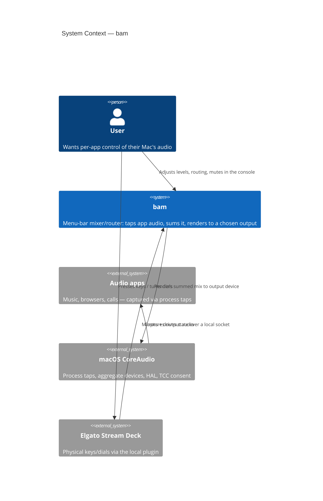
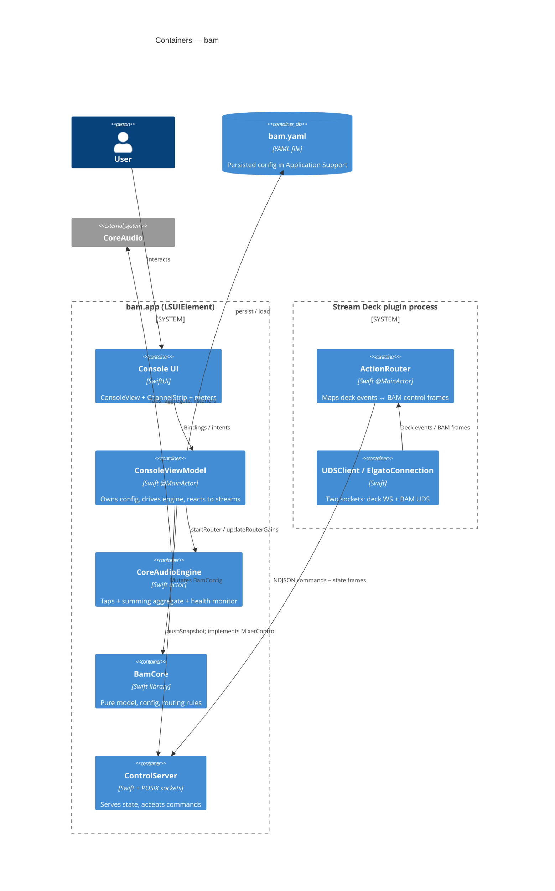
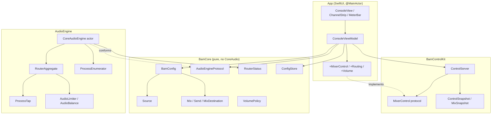

# Architecture Overview

## System Context (C4 Level 1)

bam is a menu-bar agent that a **user** drives directly (the console) or
remotely (a Stream Deck). It sits between the user's applications and the audio
hardware, using macOS CoreAudio as its integration surface.

## Container Architecture (C4 Level 2)

There are two OS processes: the **bam app** and the **Stream Deck plugin**
(launched by the Stream Deck host app). They communicate over a Unix-domain
control socket. Inside the app, `BamKit` provides three libraries.

## Component Architecture (C4 Level 3)

The dependency graph is strictly layered — **BamCore has no CoreAudio import**,
and the UI never touches CoreAudio directly. Everything flows through the
`AudioEngineProtocol` and `MixerControl` abstractions, which keeps the model
testable with mocks.

## Architectural Patterns

- **Layered / hexagonal-ish**: the pure model (`BamCore`) sits at the center;
  side effects (CoreAudio, sockets, filesystem) live at the edges behind
  protocols (`AudioEngineProtocol`, `MixerControl`). Tests substitute
  `MockAudioEngine` and `MockMixerControl`.
- **Actor isolation**: `CoreAudioEngine` is an `actor`, serializing all
  CoreAudio object lifetimes. UI-facing state stays on `@MainActor`
  (`ConsoleViewModel`, `MixerControl`).
- **Event-driven recovery**: instead of blind polling, the engine emits
  `routerEvents()` (device/process-list changes) and
  `routerRecoveryEvents()`; the view model waits for the *right* event to retry
  a failed router (see `RouterFailureCause`).
- **Lock-free RT boundary**: the audio IOProc communicates with non-RT code only
  through `AtomicFloat`/`ManagedAtomic` cells — no locks, no allocation on the
  audio thread.
- **Value-type model + intent methods**: config is immutable value types
  mutated through `applyTopology` / `applyGains`, which decide whether a change
  needs a tap rebuild or just a live gain refold.
- **Signature-based reuse**: taps and the aggregate carry content signatures so
  edits that don't change the tap set never rebuild (no TCC re-prompt, no
  audible gap).

## Key Design Decisions

1. **One summing aggregate, one clock domain.**
   - *Decision*: capture every source tap *together with* the output device in a
     single hardware-clocked aggregate, and sum taps×gain into the output inside
     one IOProc.
   - *Rationale*: a single clock domain means no capture/playback clock split,
     no ring buffer, and no underrun race.
   - *Trade-off*: all live sources currently render to one hardware output; the
     model's per-mix virtual-device destinations are represented but fold into
     per-source gains for the live path.

2. **Process taps over a virtual driver for the core path.**
   - *Rationale*: no kernel extension, no SIP changes, sanctioned macOS 14.4+
     API. The GPL BlackHole-derived `BAMDriver/` is kept separate and optional.
   - *Trade-off*: requires TCC audio-capture consent, which arrives
     asynchronously and needs a recovery heartbeat.

3. **Cause-aware recovery instead of retry loops.**
   - *Rationale*: different failures heal on different triggers (a device
     appearing, a permission grant, an app starting). Encoding the *cause*
     (`RouterFailureCause`) lets the view model wait for the matching event and
     avoid burning CPU or flashing "offline".

4. **Separate control process for the Stream Deck.**
   - *Rationale*: the Stream Deck host launches plugins as their own processes;
     a local NDJSON socket keeps the plugin in lockstep with the console while
     isolating crashes.

## Module Breakdown

### BamCore
- **Purpose**: the single source of truth for the routing model and its rules.
- **Key components**: `BamConfig` (master, sources, mixes, solo, pans),
  `Source`, `Mix`/`Send`/`MixDestination`, `AudioTaper`, `VolumePolicy`,
  `RouterStatus`, `AudioEngineProtocol`, `ConfigStore`.
- **Dependencies**: Yams only. **No CoreAudio.**

### AudioEngine
- **Purpose**: realize a `BamConfig` as live audio and stream back meters/health.
- **Key components**: `CoreAudioEngine` (actor), `RouterAggregate`,
  `ProcessTap`, `ProcessEnumerator`, `AudioLimiter`, `AudioBalance`,
  `AtomicFloat`, `ChangeListener`.
- **Dependencies**: BamCore, swift-atomics, CoreAudio.

### App
- **Purpose**: the menu-bar console and the orchestration hub.
- **Key components**: `BamApp`/`AppDelegate` (window, status item, single-
  instance guard), `ConsoleViewModel` (+ Routing / Volume / MixerControl
  extensions), `ConsoleView`, `ChannelStrip`, `MeterBar`.
- **Dependencies**: BamCore, AudioEngine, BamControlKit.

### BamControlKit
- **Purpose**: expose and drive the live model over a local socket.
- **Key components**: `ControlServer` (POSIX socket loop, NDJSON framing,
  diff broadcasting), `MixerControl` protocol, wire snapshot types,
  `MockMixerControl`.
- **Dependencies**: BamCore.

### BAMStreamDeck
- **Purpose**: the Stream Deck plugin executable.
- **Key components**: `Plugin`, `ActionRouter`, `ElgatoConnection`, `UDSClient`,
  `KeyImage`/`KeyStyleImage` renderers.
- **Dependencies**: BamControlKit.
