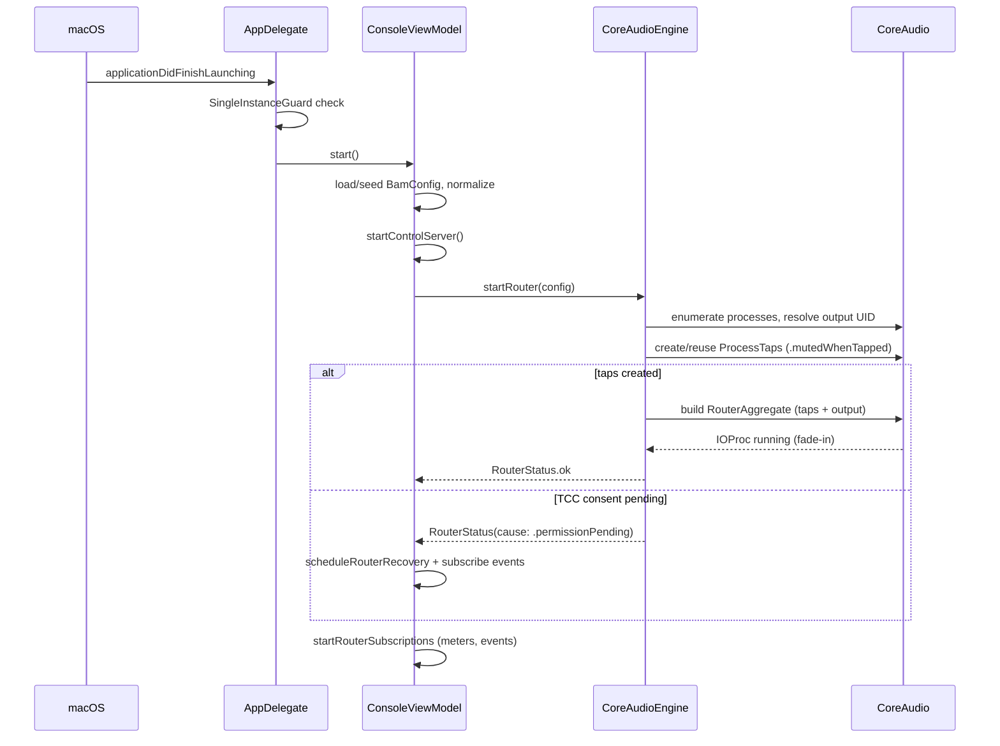
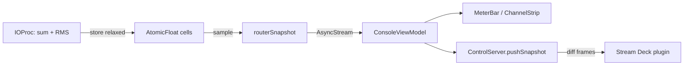
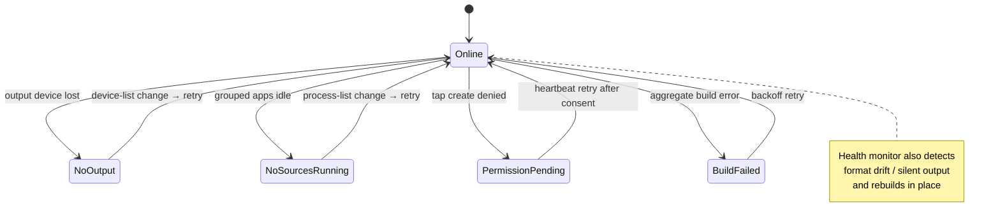
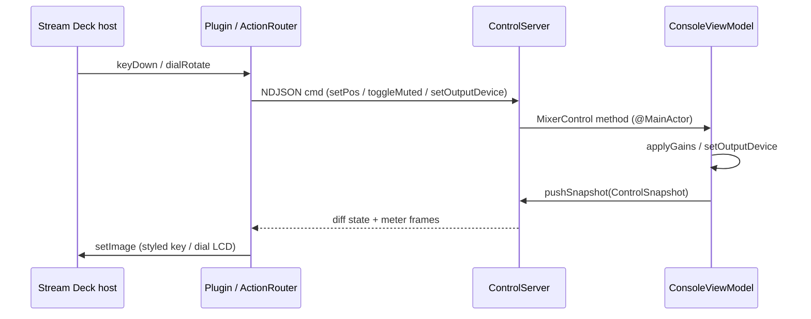
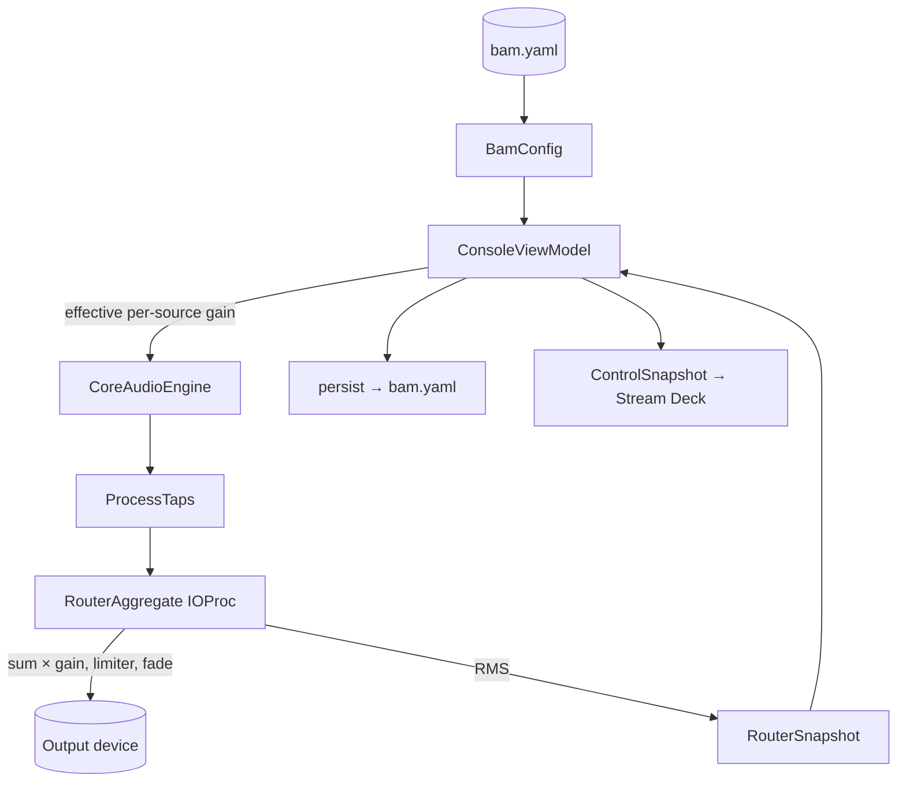

# Workflow Overview

## Core Workflows

### Workflow 1: App launch & first route

On launch bam builds its menu-bar window and status item, loads (or seeds) the
config, starts the control server, then brings the router online. Because a
process tap requires TCC audio-capture consent, the very first `startRouter` may
return `permissionPending` and heal later via the recovery path.



### Workflow 2: Live routing / gain edit

Every console edit mutates the `BamConfig` value through `applyTopology` (adds
or removes taps/mixes) or `applyGains` (level/mute/solo/pan/master only). Gain
edits take the hot path: the aggregate keeps running and only refolds gains — no
tap rebuild, no permission prompt, no audible gap.

```mermaid
sequenceDiagram
  participant User
  participant UI as ConsoleView
  participant VM as ConsoleViewModel
  participant Eng as CoreAudioEngine
  participant RA as RouterAggregate

  User->>UI: drag fader / toggle mute
  UI->>VM: applyGains { cfg.mutate }
  VM->>VM: persist(cfg)
  alt gains only
    VM->>Eng: updateRouterGains(config)
    Eng->>RA: setGain(sourceID, l, r) per tap
    Note over RA: next IOProc uses new gains
  else topology changed
    VM->>Eng: startRouter(config)
    Eng->>Eng: reuse taps by signature; rebuild aggregate only if tap set/output changed
  end
```

### Workflow 3: Meter streaming

While the router runs, the IOProc writes RMS values into lock-free `AtomicFloat`
cells per tap. A non-RT task samples them into `RouterSnapshot`s and publishes
an `AsyncStream`; the view model renders meters and also pushes a
`ControlSnapshot` to the control server for remote surfaces.



### Workflow 4: Router recovery

A failed or degraded router heals on the trigger that matches its cause. The
engine's health monitor watches the live aggregate; device/process changes fire
`routerEvents()`, and `permissionPending` (which fires no CoreAudio change) is
caught by a heartbeat. Recovery attempts and rate-limit pauses are surfaced via
`routerRecoveryEvents()`.



### Workflow 5: Remote control (Stream Deck)

The plugin process holds two sockets: the Elgato WebSocket (to the deck host)
and BAM's Unix-domain control socket. `ActionRouter` translates deck events into
NDJSON commands and BAM state/meter frames into rendered key images.



## Data Flow



## State Management

- **Config** (`BamConfig`) is the single source of truth, owned by
  `ConsoleViewModel` on `@MainActor` and persisted to `bam.yaml`.
- **Live audio state** lives inside the `CoreAudioEngine` actor (taps, the
  aggregate, health baselines) and is never shared directly — only surfaced as
  immutable snapshots and events.
- **RT↔UI** state crosses the audio-thread boundary exclusively through
  lock-free atomic cells.
- **Effective gain** for each source is derived (not stored) from the mix
  send level, per-mix master, global master, mute, solo, and pan.

## Error Handling

- **Config errors** are typed (`BamConfigError`) and surfaced by validation
  before a config is ever applied (duplicate ids, cross-mix routing conflicts,
  unknown solo/send references, multiple remainders).
- **Router failures** are modeled as data (`RouterStatus` +
  `RouterFailureCause`), not thrown — the view model chooses a recovery strategy
  per cause.
- **Health degradation** (silent output, format drift) is detected by the
  monitor and rebuilt in place, rate-limited to avoid thrash.
- **Control socket** issues (malformed frames, version mismatch, send failures)
  are counted in `ControlServerDiagnostics` and never crash the app.
