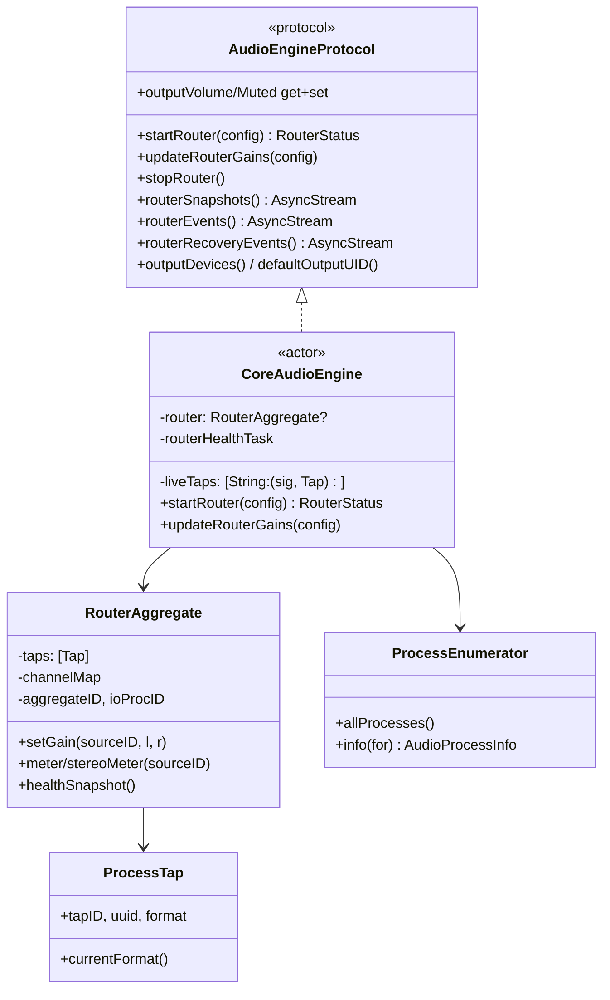

# Deep Dive: Audio Engine

## Overview

`AudioEngine` is the only module that touches CoreAudio. Its public face is the
`CoreAudioEngine` actor, which conforms to `AudioEngineProtocol` (defined in
BamCore). Given a `BamConfig`, it creates a process tap per source, builds a
single hardware-clocked aggregate that sums every tap into the chosen output,
and streams back live meters and health/recovery events.

## Responsibilities

- Enumerate audio processes and output devices; resolve the effective output UID.
- Create/reuse process taps for grouped apps and the "Everything Else" remainder.
- Build and run one summing `RouterAggregate` (taps + output in one IOProc).
- Apply live per-source L/R gains folded from the config.
- Monitor router health and drive cause-aware recovery.
- Publish `routerSnapshots()`, `routerEvents()`, `routerRecoveryEvents()`.
- Read/write OS output volume and mute for the master path.

## Architecture

## Key Files

- **`CoreAudioEngine.swift`** (~35 KB): the actor. Owns tap lifecycle, aggregate
  rebuild logic, the health monitor, recovery, and all output-device I/O.
- **`RouterAggregate.swift`** (~21 KB): the aggregate device and its IOProc — the
  real-time summing/metering core.
- **`ProcessTap.swift`**: a single `AudioHardwareCreateProcessTap` wrapper;
  reads the negotiated stream format; destroys the tap in `deinit`.
- **`ProcessEnumerator.swift`**: HAL process/device enumeration
  (`AudioProcessInfo`, `OutputDeviceInfo`).
- **`CoreAudioProperty.swift`**: the `CA` helpers for reading HAL properties.
- **`ChangeListener.swift`**: registers a HAL property listener → `onChange`.
- **`AtomicFloat.swift`**: lock-free `Float` cell (bit-pattern in `ManagedAtomic`).
- **`AudioLimiter.swift`** / **`AudioBalance.swift`**: pure DSP helpers.
- **`RMSMeter.swift`** (BamCore): dBFS metering math, floor constant.

## Implementation Details

### One aggregate, one clock domain

`RouterAggregate` captures every source tap *together with* the selected output
device in a single aggregate. The output device drives the clock, so the IOProc
receives all captured input and the render buffer in the same callback and sums
`tap × liveGain` straight into the output. Because there is one clock domain,
there is **no ring buffer**, no capture/playback clock split, and no underrun
race. All taps are `.mutedWhenTapped`, so each captured app's own output is
silenced and only bam's summed mix reaches the hardware.

### Tap resolution & signature reuse

`startRouter` resolves each `.app` source to the set of live process object IDs
matching its bundle IDs, plus one `.rest` remainder tap that *excludes* all
grouped processes and bam itself (avoiding double-counting and self-capture
feedback). Each desired tap gets a **signature** — the exact process object set
— so an existing live tap with an unchanged signature is reused verbatim. Only
genuinely new/changed targets call `ProcessTap(...)`, which is what re-fires the
TCC consent prompt. Edits that don't change the tap set (renames, gain tweaks,
adding an empty group) therefore create nothing.

The aggregate itself carries a signature (`outputUID + tap UUIDs`). If both the
tap set and output are unchanged, `startRouter` only refolds gains on the
running aggregate — the hot path. Otherwise it does a **break-before-make**
rebuild; because the reused taps stay alive across the swap (apps stay muted),
the gap is brief silence, never an unmute blast.

### Effective gain folding

The IOProc only knows per-source L/R linear gains. `applyRouterGains` folds the
whole config — mix send level, per-mix master, global master + mute, global
single solo, and per-source pan (`AudioBalance`) — into one `(l, r)` pair per
source and calls `RouterAggregate.setGain`. Gains are written into `AtomicFloat`
cells the IOProc reads on its next fire.

### Safety nets

- **Fade-in**: the summed output ramps 0→1 over the first ~2048 frames (~43 ms
  at 48 kHz) after the aggregate goes live, so a fresh router can never step from
  silence to full level.
- **Limiter** (`AudioLimiter`): a full-buffer scalar that prevents clipping while
  preserving waveform shape, with immediate overload and gradual release to avoid
  gain wobble on sustained low-frequency peaks.
- **Balance** (`AudioBalance`): a stereo balance law (not equal-power pan) so
  centered stereo material stays at unity instead of dropping ~3 dB.

### Health monitor & recovery

After a successful build, `startRouterHealthMonitor` snapshots a baseline
(output sample rate, per-source format) and periodically compares it against the
live `HealthSnapshot`/`SourceHealthSnapshot` counters written by the IOProc. It
detects **silent output**, **format drift**, and **stalled input**, then rebuilds
in place. Recovery is cause-aware and rate-limited; attempts and pauses are
emitted on `routerRecoveryEvents()`. See *Router Recovery* below for the state
model.

## Real-time boundary

The IOProc runs on a CoreAudio real-time thread. It must not allocate or lock.
All communication with non-RT code goes through preallocated scratch buffers
(summation, per-channel RMS accumulators, limiter gain, played-frame counter)
and `AtomicFloat` / `ManagedAtomic` cells written with `.relaxed` ordering. The
`channelMap` (global input channel → owning tap + L/R) is built once at
aggregate construction, assuming the aggregate presents tap channels in tap-list
order, and confirmed at runtime by diagnostic counters.

## Testing

- **`RouterSmokeTests`**, **`MixerDeviceIntegrationTests`**: exercise router
  build/rebuild and device integration.
- **`MixerTests`**: gain-folding correctness.
- **`RMSMeterTests`**: metering math.
- The engine is mocked via `MockAudioEngine` (BamCore) so `ConsoleViewModel`
  logic can be tested headless.

## Potential Improvements

- Realize the model's per-mix virtual-device destinations as independent
  aggregates so distinct mixes can target distinct hardware simultaneously.
- Surface limiter activity in the UI for transparency.
