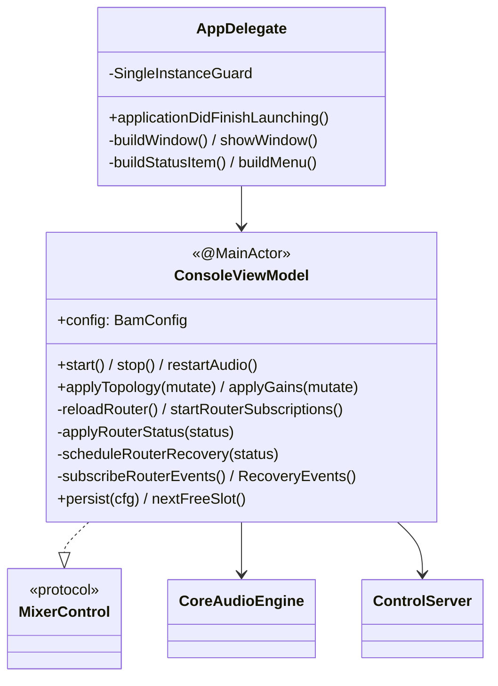

# Deep Dive: Console UI & ConsoleViewModel

## Overview

The `App/` target is the menu-bar console and the orchestration hub. bam runs as
an `LSUIElement` agent (no Dock icon): `AppDelegate` builds a borderless window
and a status-bar item, and `ConsoleViewModel` (an `@MainActor` class) owns the
config, drives the `CoreAudioEngine`, reacts to its event streams, and serves as
the live `MixerControl` implementation for remote surfaces.

## Responsibilities

- **AppDelegate / BamApp**: window + status item, menu, single-instance guard,
  lifecycle (`start`/`stop`), traffic-light centering.
- **ConsoleViewModel**: own `BamConfig`; apply topology/gain edits; start and
  subscribe to the router; schedule recovery; run the control server; manage the
  launch/exit volume hand-off.
- **SwiftUI views**: render channel strips, faders, meters, and routing controls
  bound to the view model.

## Architecture

The view model is split across extensions to keep each concern isolated:

- **`ConsoleViewModel.swift`** — lifecycle, config ownership, router
  subscription/recovery, persistence.
- **`ConsoleViewModel+Routing.swift`** — source/mix editing intents.
- **`ConsoleViewModel+Volume.swift`** — master + OS output volume, launch/exit
  hand-off (backed by `VolumePolicy`).
- **`ConsoleViewModel+MixerControl.swift`** — bridges the live model onto the
  `MixerControl` surface the Stream Deck drives.

## Implementation Details

### Config edits: topology vs gains

All edits funnel through two intents:

- **`applyTopology { cfg in ... }`** — changes that may add/remove taps or mixes.
  Triggers `startRouter`, which reuses taps by signature and rebuilds the
  aggregate only when the tap set or output actually changed.
- **`applyGains { cfg in ... }`** — level/mute/solo/pan/master only. Triggers
  `updateRouterGains`, the hot path that refolds gains on the running aggregate
  with no rebuild.

Both persist the new config. A mutation queue (`enqueueRouterMutation` /
`enqueueRouterWork`) serializes work against the engine actor so rapid edits
don't race.

### Startup sequence

`start()` normalizes/loads the config, captures the stock OS output volume,
starts the control server, then reloads the router and subscribes to its streams
(`routerSnapshots`, `routerEvents`, `routerRecoveryEvents`). `startMock` provides
a headless path for tests.

### Reacting to router status

`applyRouterStatus` maps a `RouterStatus` to UI/recovery behavior. For
recoverable failures it calls `scheduleRouterRecovery`, which subscribes to the
matching event source and retries at the right moment (see *Router Recovery*).
`enterSilentRouterState` handles the graceful-degradation case.

### Volume hand-off

Because the master fader is backed by the OS output-device volume,
`ConsoleViewModel+Volume` uses `VolumePolicy` to decide how to restore volume on
launch and exit (persisting `savedOutputVolume` / `stockVolume` in
`UserDefaults`), so bam doesn't leave the system at an unexpected level.

### Single-instance guard

`SingleInstanceGuard` (in `BamApp.swift`) checks for another running bam
(matching known bundle identifiers, including the `.dev` debug build) and
terminates the duplicate — important because two engines fighting over the same
taps and output would contend.

## Key Files

- **`BamApp.swift`**: `@main` app, `AppDelegate`, window/status-item/menu,
  single-instance guard.
- **`ConsoleViewModel.swift`** (+ `+Routing`, `+Volume`, `+MixerControl`): the
  hub.
- **`ConsoleView.swift`**, **`ChannelStrip.swift`**, **`MeterBar.swift`**: views.
- **`ConsoleTheme.swift`**: design tokens (colors, spacing, typography).
- **`ConsoleDiagnostics.swift`**: in-app diagnostics surface.
- **`AudioRecoveryDisplayState.swift`**: recovery banner/state for the UI.

## Testing

`AppTests` runs against the mock engine: `ConsoleViewModelUseCaseTests`
(edit → router-call behavior) and `RouterRecoveryTests` (status → recovery
scheduling). The test host is torn down by a scheme post-action to avoid orphan
processes.

## Potential Improvements

- Extract the recovery scheduling into a standalone testable coordinator.
- Consider `@Observable` migration cleanup if any manual change-notification
  remains.
