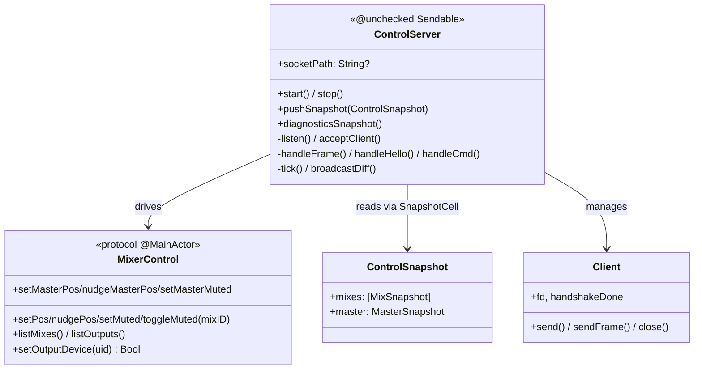

# Deep Dive: Control Server & Wire Protocol (BamControlKit)

## Overview

`BamControlKit` lets an external process observe and drive the running mixer over
a local **Unix-domain socket**. The app runs a `ControlServer`; the Stream Deck
plugin is the client. Messages are **NDJSON** (one JSON object per line). The
server reads a live `MixerControl` (implemented by `ConsoleViewModel`) and
broadcasts diffed state plus ~30 fps meter frames.

## Responsibilities

- Listen on a Unix-domain socket, accept multiple clients.
- Enforce a versioned handshake before accepting commands.
- Translate incoming command frames into `MixerControl` calls on `@MainActor`.
- Broadcast full state on change and level-only meter frames on a timer.
- Track health via `ControlServerDiagnostics` and never crash the app.

## Architecture



## Concurrency model

- The socket accept/read/write loop and the meter timer run on a background
  `DispatchQueue` (`bgQueue`), never blocking the main actor.
- Incoming commands hop to `@MainActor` via `Task { @MainActor in ... }` before
  touching the model, because `MixerControl` is main-actor isolated.
- State flows the other way through a lock-free `SnapshotCell`: the view model
  calls `pushSnapshot`, the timer `tick()` reads the latest snapshot directly on
  `bgQueue` with no actor hop.

## Wire Protocol

Every frame is a JSON object with a type tag `t`, newline-terminated.
Protocol version is `1`; `kAppName` is `"BAM"`.

### Handshake (required first)

```
→ {"t":"hello","v":1,"client":"streamdeck"}
← {"t":"hello-ack","v":1,"app":"BAM","build":"1.0.1"}
```

A version mismatch returns `{"t":"error","code":"version"}` and the connection is
dropped. Until `handshakeDone`, all `cmd`/`list*`/`setOutputDevice` frames are
ignored.

### Commands (client → server)

`{"t":"cmd","op":"<op>", ...}` — dispatched to `MixerControl`:

| op | args | effect |
|----|------|--------|
| `setPos` | `mix`, `pos` (0…1) | set a mix's perceptual position |
| `nudgePos` | `mix`, `delta` | relative bump |
| `setMuted` | `mix`, `muted` | set mute |
| `toggleMuted` | `mix` | flip mute |
| `setMasterPos` | `pos` | set master position |
| `nudgeMasterPos` | `delta` | relative master bump |
| `setMasterMuted` | `muted` | set master mute |

### Queries (client → server)

- `{"t":"listMixes"}` → `{"t":"mixes","mixes":[{id,name,emoji}, ...]}`
- `{"t":"listOutputs"}` → `{"t":"outputs","outputs":[{uid,name,active,icon}, ...]}`
- `{"t":"setOutputDevice","uid":"..."}` → `{"t":"outputs-ack","uid":"..."}` or
  `{"t":"error","code":"unsupported","op":"setOutputDevice"}`

### State & meters (server → client)

- A **full `state` frame** carries the current `MixSnapshot`s and
  `MasterSnapshot` (id, name, emoji, `pos`, `pct`, `muted`, `level`,
  `levelLeft`, `levelRight`, plus the master's output `icon`).
- **Meter frames** are level-only and sent on every timer tick (~30 fps,
  33 ms), so remote surfaces animate smoothly.
- `broadcastDiff` compares against `lastSnapshot` and only sends the full state
  when non-level fields change; meter frames always flow. This keeps the socket
  quiet during steady state.

## Snapshot types

`ControlSnapshot` = `{ mixes: [MixSnapshot], master: MasterSnapshot }`.
Levels are raw dBFS; `pos`/`pct` are perceptual (via `AudioTaper`) so the wire
carries what a controller renders directly. Icons are SF Symbol names matching
the console's own device-icon logic, so a Stream Deck key looks identical to the
app.

## Diagnostics

`ControlServerDiagnostics` counts `activeClients`, `acceptedClients`,
`removedClients`, `malformedFrames`, `versionRejects`, and `sendFailures`.
Malformed frames and version rejects are logged and dropped; a client whose send
fails is removed. Nothing in the socket path can bring down the app.

## Key Files

- **`ControlServer.swift`**: socket loop, framing, handshake, dispatch,
  diff/broadcast, diagnostics.
- **`MixerControl.swift`**: the protocol + all wire snapshot types.
- **`MockMixerControl.swift`**: scriptable in-memory implementation for headless
  tests.

## Testing

`BamControlKitTests` (`ControlServerTests`) drives the server against
`MockMixerControl`: handshake enforcement, command dispatch, frame
encode/decode, and diff behavior.

## Potential Improvements

- Bump the hardcoded `kBuildVersion` from the build system instead of a literal.
- Consider authentication or a per-launch socket token if the socket ever
  becomes reachable beyond the local user.
