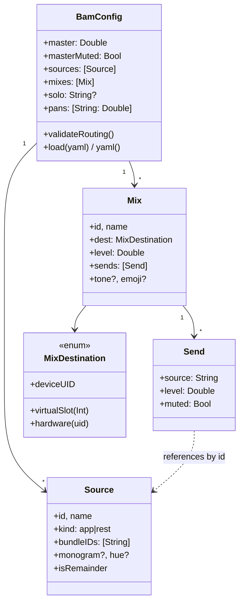

# Deep Dive: Core Model & Config (BamCore)

## Overview

`BamCore` is the pure heart of bam: the routing model as value types, the rules
that validate and normalize it, and the protocol boundary to the audio layer. It
imports only Yams — **no CoreAudio** — which keeps the entire model unit-testable
without hardware or permissions.

## Responsibilities

- Define the persisted routing model: `BamConfig`, `Source`, `Mix`, `Send`,
  `MixDestination`.
- Validate config integrity (`validateRouting`) and encode/decode YAML.
- Provide pure decision logic: `AudioTaper` (perceptual fader law),
  `VolumePolicy` (launch/exit volume hand-off), `RMSMeter` (dBFS math).
- Model router outcomes (`RouterStatus`, `RouterFailureCause`) and the engine
  contract (`AudioEngineProtocol`).
- Resolve and persist the editable `bam.yaml` (`ConfigStore`).

## The Model

## Key Concepts

### Sources

A `Source` is a routable input. Its `kind` is either:
- **`.app`** — one or more app bundle IDs grouped under a stable `id`. Mixes
  reference the source by `id`, so renaming is safe.
- **`.rest`** — the singleton **"Everything Else"** remainder. It captures every
  app not in a named group, is non-deletable, and there may be at most one.

Optional `monogram`/`hue` are display affordances used by the console and the
Stream Deck tiles.

### Mixes & Sends

A `Mix` is a destination bus: a set of `Send`s (which sources feed it, at what
level, muted or not), a per-mix master `level`, and exactly one
`MixDestination`. **The absence of a `Send` for a source means mix-minus** —
that source is simply not in the mix. `MixDestination` is either a
`virtualSlot(Int)` (a BAM virtual-device pool slot, UID `BAM_UID_<n>`) or
`hardware(uid:)` (a real output, e.g. the Monitor mix).

> Note: the live `AudioEngine` currently sums all sources into a single hardware
> aggregate, folding each mix's level into its sources' effective gain. The
> multi-destination model is fully represented and validated even though the live
> render path targets one output at a time.

### Effective gain

The gain actually applied to a source is *derived*, never stored. It is the
product of: the `Send.level`, the mix `level`, the global `master`, and gates
from `Send.muted`, `masterMuted`, and the global single `solo`; then split into
L/R by the per-source `pan` via `AudioBalance`. `AudioTaper` maps the
perceptual fader position (0…1) shown in the UI to/from linear gain.

## Validation

`validateRouting()` is the gatekeeper — a config is validated before it is ever
applied or persisted. It rejects:

- Duplicate source ids / mix ids.
- A `Send` referencing an unknown source.
- A source routed into **more than one** mix (`duplicateSourceRoutes`).
- An app bundle id belonging to **more than one** source group
  (`duplicateAppAssignments`).
- A `solo` referencing an unknown source.
- More than one `.rest` remainder source.

Each failure is a typed `BamConfigError` with a human-readable `description`.

## Persistence

`ConfigStore` resolves the user-editable `bam.yaml` under Application Support and
persists changes. `BamConfig` uses lenient decoding — every field has a default
via `decodeIfPresent` — so older/partial YAML loads forward-compatibly. Encoding
is via `YAMLEncoder`.

## Router Status

`RouterStatus` carries the outcome of a `startRouter` call: `failedMixIDs` plus a
single dominant `RouterFailureCause`. The cause distinguishes *broken* from
*idle*:

| Cause | Meaning | Heals on |
|-------|---------|----------|
| `ok` | live, or nothing to route | — |
| `noOutput` | no hardware dest and no default output | device-list change |
| `permissionPending` | tap create denied (TCC) | heartbeat after consent |
| `noSourcesRunning` | grouped apps idle (not an error) | process-list change |
| `buildFailed` | aggregate build error | backoff retry |

`isFailure` is false for `ok` and `noSourcesRunning` (healthy/idle), so the UI
never flashes "offline" for an idle console.

## Key Files

- **`BamConfig.swift`**: the aggregate root + validation + YAML.
- **`Source.swift`**, **`Mix.swift`**: model value types.
- **`RouterStatus.swift`**: outcome + cause enum.
- **`AudioEngineProtocol.swift`**: the engine contract.
- **`AudioTaper.swift`**, **`VolumePolicy.swift`**, **`RMSMeter.swift`**: pure
  logic.
- **`ConfigStore.swift`**: filesystem resolution + persistence; also
  `AudioApp`/`AudioDevice` DTOs (incl. `outputIcon` SF Symbol mapping).
- **`Group.swift`**, **`EmojiInput.swift`**, **`MeterSnapshot.swift`**: helpers.
- **`MockAudioEngine.swift`**: headless engine stand-in for tests.

## Testing

`BamCoreTests` covers config round-tripping (`BamConfigTests`,
`ConfigStoreTests`), the routing rules (`RoutingModelTests`), the fader law
(`VolumePolicyTests`), metering (`RMSMeterTests`), and emoji parsing
(`EmojiInputTests`).

## Potential Improvements

- Schema-version the YAML explicitly to make future migrations first-class.
- Expose the derived effective-gain computation as a shared pure function so the
  UI, engine, and tests cannot drift.
