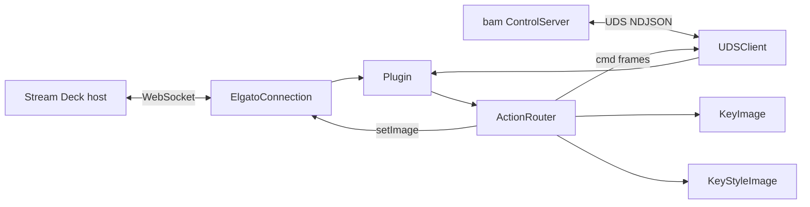

# Deep Dive: Stream Deck Plugin (BAMStreamDeck)

## Overview

The Stream Deck plugin is a **separate executable** (`BAMStreamDeck`) launched by
the Elgato Stream Deck host app. It bridges two sockets: the Elgato WebSocket (to
the deck) and BAM's Unix-domain control socket (to the running app). `Plugin`
wires them together; `ActionRouter` holds all key/dial state and does the
two-way translation, rendering styled key/dial artwork that matches the console.

The plugin ships in `StreamDeck/me.harke.better-audio-mixer.sdPlugin/`
(manifest, Property Inspectors, layouts); the compiled binary is dropped into the
bundle's `bin/`.

## Responsibilities

- Speak the Elgato WebSocket protocol (`ElgatoConnection`, `ElgatoRegistration`).
- Connect to BAM's control socket and perform the NDJSON hello
  (`UDSClient`).
- Map deck events (keyDown, dialRotate, dialPress) to BAM commands.
- Ingest BAM state/meter frames and render key/dial images
  (`KeyImage`, `KeyStyleImage`).
- Keep every visible key in sync, throttled to what actually changed.

## Architecture

## The three actions

Declared in `manifest.json`, each backed by a Property Inspector under `pi/`:

1. **Device** — control one app group. On a **key** it renders a styled tile
   (colored monogram, name, %, meter artwork) in one of three styles — **Level
   Meter**, **Level Bars**, or **Radial Gauge** — chosen in the PI. On a **dial**
   it shows a smooth live LCD meter with the same controls.
2. **Master** — the same, for the master bus.
3. **Output Device** — set or toggle the active hardware output; the key shows
   the same device icon the console uses (headphones, speaker, display…),
   resolved live from the app.

## Implementation Details

### Event mapping

`ActionRouter.handleEvent` dispatches Elgato events:

- **`keyDown`** → for Device/Master, a mute/level action (`keyDown`,
  `sendMasterMute`); for Output Device, `outputKeyDown` (set/toggle output).
- **`dialRotate`** → `dialRotate` → `nudgePos`/`nudgeMasterPos`, quantized by a
  step; `wrapPos` handles percentage wrap.
- **`dialPress`** → `dialPress` → toggle mute.
- **`willAppear`/PI events** → `bind`, `piAppeared`, and PI mix/output lists
  (`sendMixesToPI`, `sendOutputsToPI`).

### Ingesting BAM frames

`ingestBAMFrame` routes inbound frames by type: `state`/`delta`/`masterDelta`
(model state), `meter` (levels), `mixes`/`outputs` (lists for the PI), `error`,
`outputs-ack`. Meter values are **smoothed** (`smoothLevel`, `smoothStereo`)
before display so the LCD/meter doesn't jitter.

### Render throttling

Rendering to a Stream Deck is expensive, so `ActionRouter` computes a
**signature** for each key/dial's current visual and only pushes a new image when
the signature changes:

- `keyLevelSignature` / `keyImageSignature` — quantize level into steps so tiny
  meter changes don't redraw.
- `dialStaticSignature` / `dialMeterSignature` / `dialFeedbackSignature` — the
  same idea for dials, split into static vs meter parts.
- `setStateIfChanged` / `setTitleIfChanged` — avoid redundant Elgato calls.
- `shouldSkipDialFeedback` / `shouldRefreshKeyMeter` — rate-limit meter redraws.

### Rendering

- **`KeyImage`** renders a single glyph (emoji or SF Symbol) centered on a tile —
  used for the Output Device key's device icon (`deviceGlyph`).
- **`KeyStyleImage`** renders the rich Device/Master keypad tile: dark card,
  colored monogram (`accentPalette` / `masterAccent`), name, %, and the chosen
  meter style. `normalizedVisualStyle` maps the PI's raw style string to a
  `KeyStyle`.
- `initials` derives a monogram from a name; `colorSignature` keys the accent
  color into the render signature.

## Key Files

- **`main.swift`**, **`Plugin.swift`**: entry point + socket wiring.
- **`ActionRouter.swift`** (~7 KB): all state, event mapping, ingest, throttled
  rendering.
- **`ElgatoConnection.swift`**, **`ElgatoRegistration.swift`**: Elgato WebSocket
  protocol + launch args.
- **`UDSClient.swift`**: BAM control-socket client (hello + NDJSON).
- **`KeyImage.swift`**, **`KeyStyleImage.swift`**: image rendering.
- **`Log.swift`**: plugin logger.

### Bundle (`StreamDeck/.../*.sdPlugin`)

- **`manifest.json`**: actions, PIs, layouts.
- **`pi/common.js`**, `pi/device.html`, …: Property Inspector runtime.
- **`layouts/band.json`, `meter.json`, `slider.json`**: dial layouts.

## Testing

`BAMStreamDeckTests` (`RenderingTests`) covers level→percent/fraction mapping and
visual style normalization — the pure parts of the render path.

## Potential Improvements

- Share the SF Symbol device-icon mapping with the app via a common module to
  guarantee the deck and console never diverge.
- Coalesce meter frames further under heavy multi-key load.
